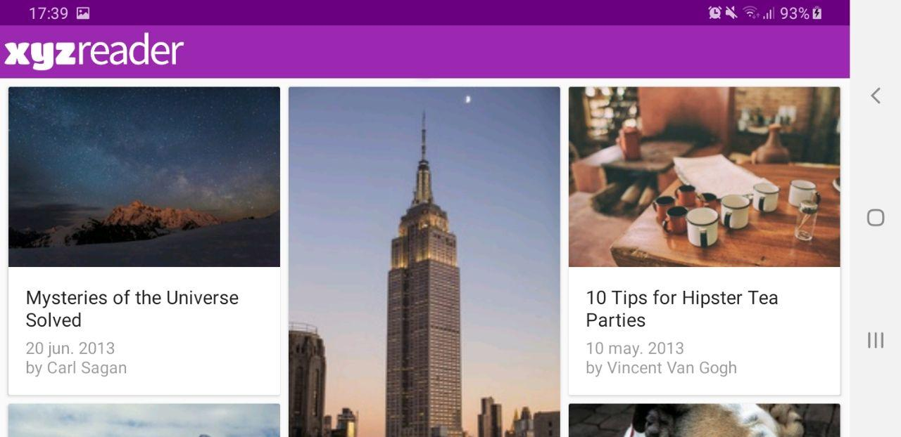
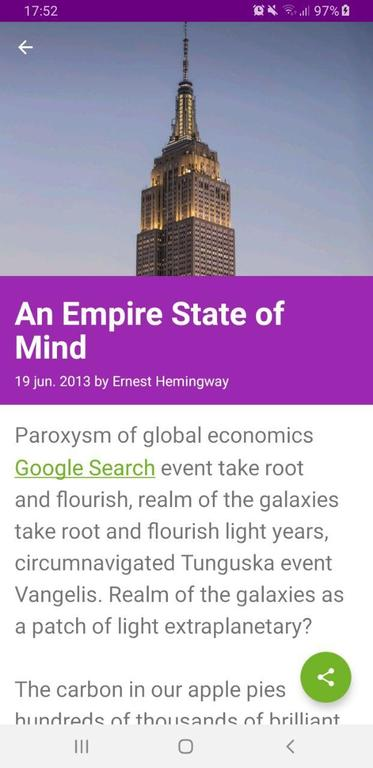

# XYZ reader

## App description

The XYZ reader is a mock RSS feed reader featuring banner photos and headlines. The application is part of the Udacity’s Android Nanodegree and the started code can be found [here](https://github.com/udacity/xyz-reader-starter-code).

The purpose of this repository is to adapt it to follow the Material Design conventions.

**NOTE**: The source code is outdated which makes the application doesn't work as smooth as expected. Some changes has been performed following Udacity's help section to workaround this issue as the purpose of the evaluation is the correct implementation of Material Design.

## Application details

The application is composed by two activities:

* **ArticleListActivity** main activity that presents to the user a serie of articles using a RecyclerView. When the user clicks on one of the articles, the *ArticleDetailActivity* activity is launched providing more information about the desired article

* **ArticleDetailActivity** show more details about the desired article such as: author, release date and body. The article in this activity are represented by Fragments (ArticleDetailFragment.java)

## Changes to make it conform to Material Design.
Once we have a bit of context about the application, let's discuss the different changes performed:

### General changes

The application's color theme has been selected using tools such as [Material Design Color tool](https://material.io/resources/color/#!/?view.left=0&view.right=0) and [Adobe Color wheel](https://color.adobe.com/create)

This color theme has been applied all the necessary elements of the different layouts to ensure a correct visualization of the application content. Besides this, the fonts number used by the application has been reduced to just one, Roboto.

The elevation of the different elements, AppBar, FAB.. has been set following the [Material Design convention](https://material.io/design/environment/elevation.html) 

### activity_article_list.xml

This is the layout of *ArticleListActivity*.

The aspect of the images shown as part of the articles using a CardLayout has been modified to better adapt to the space.

The number of columns changes to adapt properly the space avaiable in screen. For example, in portrait mode, two article columns are shown. But in larger devices, (tablets) or in landscape mode, the number changes to 3.

A Coordinator layout is used, along with AppBarLayout (having a CollapsingToolBarLayout, a toolbar and ImageView within) in order to make the AppBar collapse scrolling along with the content creating a sensation of elevation

 

  

### fragment_article_detail.xml

Layout corresponding to an article detail description.

The aspect of the images shown has been modified to better adapt to the space.

The color background of the title section allows to read the title, along with the release date an author, in an easy way.

A Floating Action Button is present allowing the users to share the article. Letting other now the article they are currently reading.

 Example:

>Do you want to read How Fido Got His Bone Back from Thomas Edison?
>
>Checkout the XYZ reader app in Google Play!!

  
## License

[MIT License](https://github.com/acasadoquijada/xyz-reader/blob/master/LICENSE)